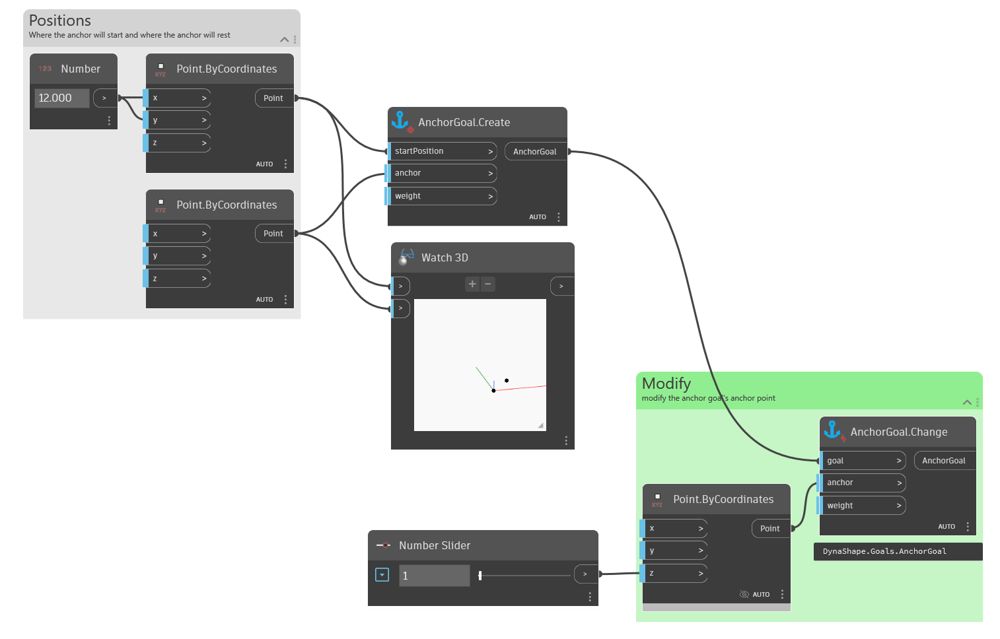

## In Depth
`AnchorGoal.Change` modifies an existing anchor. In the example below an `AnchorGoal` is first created, then it is modified while Dynamo is running. This interaction is required when using DynaShape's solver with goals.
___
## Example File

