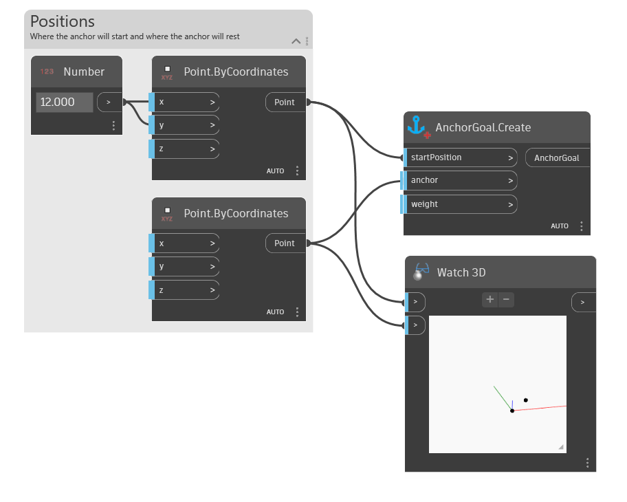

## In Depth
`AnchorGoal.Create` creates a goal definition for use with DynaShape's solver. Anchor goals are useful for "pinning" points of a mesh to a selected point.

In the example below, an `AnchorGoal` is created with a starting position defined.
___
## Example File

