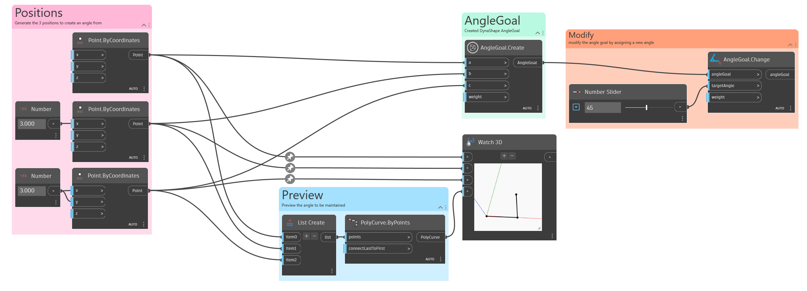

## In Depth

`AngleGoal.Change` modifies an existing angle goal. In the example below an `AngleGoal` is first created, then it is modified while Dynamo is running. This interaction is required when using DynaShape's solver with goals.

___
## Example File

