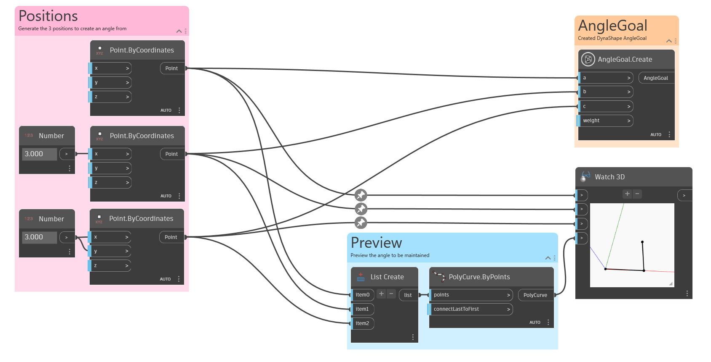

## In Depth

`AngleGoal.Create` creates a goal with the objective of maintaining an angle of three given nodes (points). 

In the example below, an `AngleGoal` is created and previewed with a `PolyCurve`.

___
## Example File

